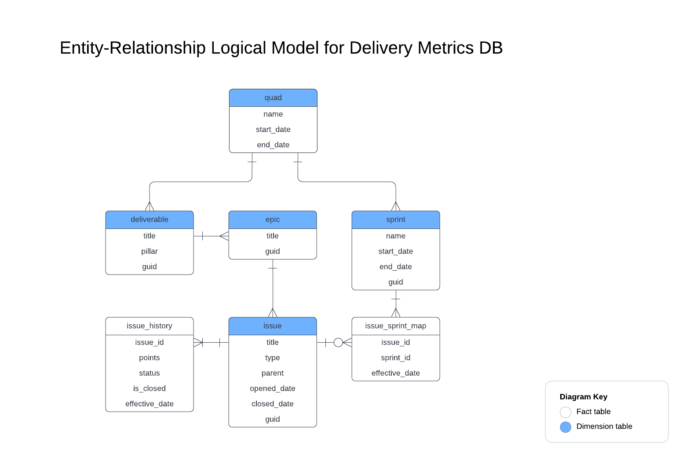

# Delivery Metrics

## DB Schema
The schema is defined in [create_delivery_metrics_db.sql](./create_delivery_metrics_db.sql) 

## SCD Update Pattern
Slowly changing data that are pertinent to as-is and as-was delivery metrics calculations are stored in the `issue_history` and `issue_sprint_map` tables. The tables utilize a datestamp column to capture the effective date of each record change over time.

## Entity Relationship Diagram
The logical model is described in [schema-ERD.png](./schema-ERD.png)

